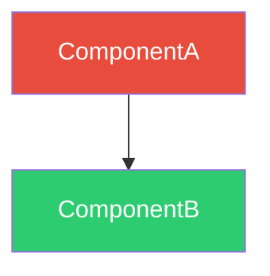

# Master Requirements Specification
## <App Name>

### 1. Purpose

<!-- 2-3 sentences: What problem does this application solve? Who does it serve?
     Be specific — avoid restating the component names. -->

### 2. Scope

This specification defines the **application-level** domain, encompassing end-to-end processes that span multiple component repositories. Individual component behavior is specified in each component's own `spec/` directory; this document defines how they compose into a complete system.

### 3. System Overview

#### 3.1 Component Registry

<!-- One row per component repo. Distinguish services vs libraries. -->

| Component | Type | Repo | Role |
|-----------|------|------|------|
| <!-- name --> | <!-- fastapi-service / python-lib / react-lib / etc --> | `<!-- repo-name -->` | <!-- What it does in 1 sentence --> |

#### 3.2 Dependency Graph

<!-- Required: Show how components connect. Use color styles to distinguish
     services (red), libraries (green), SDKs (orange), UI (purple). -->

### 4. Architecture Rationale

<!-- Required: Explain WHY the architecture looks the way it does.
     One ADR entry per major structural decision. -->

#### ADR-001: <!-- Decision Title -->

**Decision**: <!-- What was decided. One sentence. -->

**Rationale**: <!-- Why? What problem does this solve? -->

**Alternatives considered**: <!-- What else was evaluated and why it was rejected. -->

### 5. Stakeholder Requirements

| ID | Title | Artifact |
|----|-------|----------|
| StR-001 | <!-- Title --> | [StR-001](stakeholder/StR-001-<slug>.md) |

### 6. User Stories

| ID | Title | Role | Artifact |
|----|-------|------|----------|
| US-001 | <!-- Title --> | <!-- Role --> | [US-001](usecase/US-001-<slug>.md) |

### 7. Functional Requirements

<!-- Application specs MUST include these object types:
     - domain: Bounded context, ER diagram (FR-001)
     - process: One per major cross-service workflow
     - configuration: Shared config across services
     - integration: Consumer contract (how to integrate with this app) -->

| ID | Title | Object Type | Artifact |
|----|-------|-------------|----------|
| FR-001 | <!-- App --> Domain | domain | [FR-001](functional/FR-001-<slug>-domain.md) |
| FR-002 | <!-- Primary Workflow --> Process | process | [FR-002](functional/FR-002-<slug>-process.md) |
| FR-XXX | <!-- App --> Configuration | configuration | [FR-XXX](functional/FR-XXX-configuration.md) |
| FR-XXX | Consumer Integration Contract | integration | [FR-XXX](functional/FR-XXX-consumer-integration.md) |

### 8. Non-Functional Requirements

<!-- Application specs MUST include these three NFRs:
     - Security Constraints (crypto, transport, error handling)
     - System Reliability (SLA, p99 latency, scale limits, RTO/RPO)
     - Deployment Topology (namespace, ingress, discovery, secrets) -->

| ID | Title | Artifact |
|----|-------|----------|
| NFR-001 | Security Constraints | [NFR-001](non-functional/NFR-001-security.md) |
| NFR-002 | System Reliability | [NFR-002](non-functional/NFR-002-reliability.md) |
| NFR-003 | Deployment Topology | [NFR-003](non-functional/NFR-003-deployment.md) |

### 9. Domain Model

See [FR-001 <!-- App --> Domain](functional/FR-001-<slug>-domain.md) for the bounded context definition, entity relationships, and ER diagram.

### 10. Scope Boundaries

<!-- Required: Explicitly list what this application does NOT do.
     These are deliberate exclusions, not future work. -->

| Out of Scope | Rationale |
|---|---|
| <!-- Feature --> | <!-- Why deliberately excluded --> |

### 11. Security Model

<!-- Required: Define the actor model and trust hierarchy.
     What roles exist? What can each role do? -->

#### Actor Roles

| Role | Description | Assigned By |
|------|-------------|-------------|
| `anonymous` | Unauthenticated caller | Default |
| `user` | Authenticated user | Auth system |
| `admin` | Administrator | Operator |
| `operator` | Infrastructure operator | Out-of-band |

#### Trust Boundaries

<!-- List capabilities and which roles can exercise them. -->

| Capability | anonymous | user | admin | operator |
|---|---|---|---|---|
| <!-- action --> | — | ✅ | ✅ | ✅ |

### 12. References

| Standard | Description |
|----------|-------------|
| ISO/IEC/IEEE 29148 | Requirements engineering standard |
