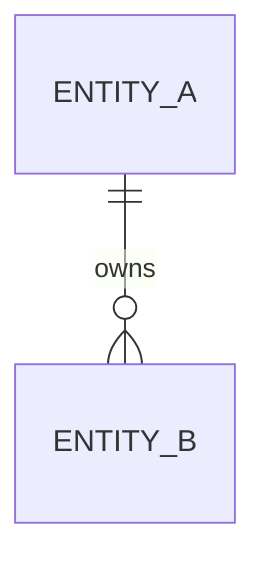

# [FR-XXX] [Domain Name] Bounded Context

## Description
This FR defines the `[Domain Name]` bounded context, establishing its scope, ubiquitous language, and the domain objects it contains.

## Related User Stories
- [US-XXX]: [Story Title]

---

## Bounded Context
| Field | Type | Description |
|-------|------|-------------|
| Name | string | [domain name] |
| Scope | string | [what this domain owns] |
| Owner | string | [service or team] |

## Ubiquitous Language
| Term | Definition |
|------|------------|
| [term] | [precise definition within this domain] |

## Entities

> OPTIONAL summary list. Entities are first-class `object: entity` FRs linked
> from this domain via `contains` relationship edges — do not duplicate their
> definitions here. Pure grammar/protocol contexts may have no entities at all;
> delete this section when so.

- [FR-A](../functional/FR-A.md): Entity — [name]
- [FR-B](../functional/FR-B.md): Value Object — [name]
- [FR-C](../functional/FR-C.md): Event — [name]
- [FR-D](../functional/FR-D.md): Process — [name]

## Entity Relationship Diagram

> OPTIONAL — a whole-domain mermaid diagram for human orientation when
> entities exist (extracted as `erd`). Delete when there are no entities.

---

## Acceptance Criteria
| ID | Criteria | Verification Method |
|----|----------|---------------------|
| FR-XXX-AC-1 | All contained objects reference this domain | Inspection |

## Dependencies
- **Upstream**: [StR-XXX]
- **Downstream**: [all contained object FRs]
