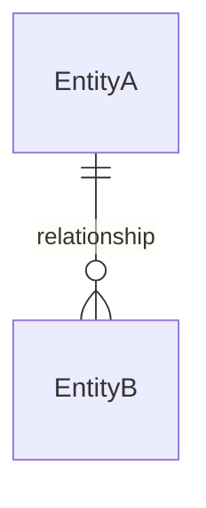

# [FR-XXX] [Entity Name] Entity

## Description
The system **SHALL** define a `[EntityName]` entity that [purpose].

## Related User Stories
- [US-XXX]: [Story Title]

---

## Properties
| Name | Type | Required | Description |
|------|------|----------|-------------|
| id | UUID | Y | Primary key |
| [field] | [type] | Y/N | [description] |

## Invariants
| ID | Constraint | Type | Rationale |
|----|------------|------|-----------|
| FR-XXX-INV-1 | [constraint using SHALL] | Data / Business | [why] |

## Relationships

---

## Constraints
| ID | Constraint | Type | Rationale | Validation |
|----|------------|------|-----------|------------|
| FR-XXX-CON-1 | [constraint] | Technical / Business | [why] | [how verified] |

## Error Handling
| Error Condition | Error Code | Response | Recovery |
|-----------------|------------|----------|----------|
| [condition] | [code] | [behavior] | [recovery] |

## Acceptance Criteria
| ID | Criteria | Verification Method |
|----|----------|---------------------|
| FR-XXX-AC-1 | [observable outcome] | Unit / Integration Test |

## Dependencies
- **Upstream**: [prerequisites]
- **Downstream**: [dependents]
