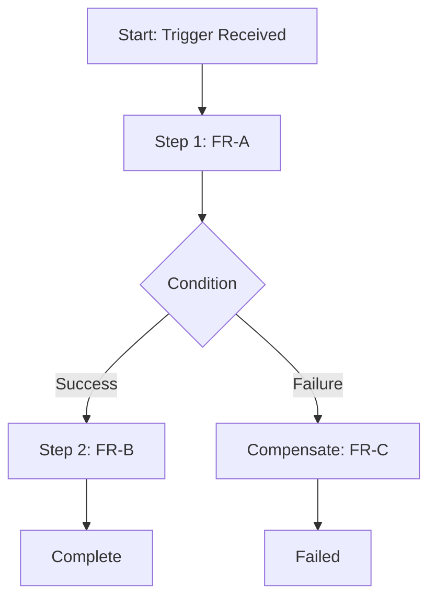

# [FR-XXX] [Process Name] Process

## Description
The system **SHALL** execute the [process name] process, which orchestrates [scope]. This process composes the following component requirements: [FR-A, FR-B, FR-C].

## Related User Stories
- [US-XXX]: [Story Title]

---

## Triggers
| Trigger Type | Value | Description |
|-------------|-------|-------------|
| event | [event.type] | [what initiates this process] |
| api | POST /[path] | [API-triggered initiation] |
| schedule | [cron expression] | [time-based initiation] |

## Workflow

---

## Constraints
| ID | Constraint | Type | Rationale | Validation |
|----|------------|------|-----------|------------|
| FR-XXX-CON-1 | [constraint] | Technical | [why] | [how verified] |

## Error Handling
| Error Condition | Error Code | Response | Recovery |
|-----------------|------------|----------|----------|
| Step N fails | [code] | [behavior] | [compensation action] |

## Acceptance Criteria
| ID | Criteria | Verification Method |
|----|----------|---------------------|
| FR-XXX-AC-1 | Given [trigger], the process SHALL execute steps [A→B→C] in order | Integration Test |
| FR-XXX-AC-2 | Given failure at step N, compensation SHALL execute | Integration Test |

## Dependencies
- **Upstream**: [triggering events/APIs]
- **Downstream**: [component FRs: FR-A, FR-B, FR-C]
