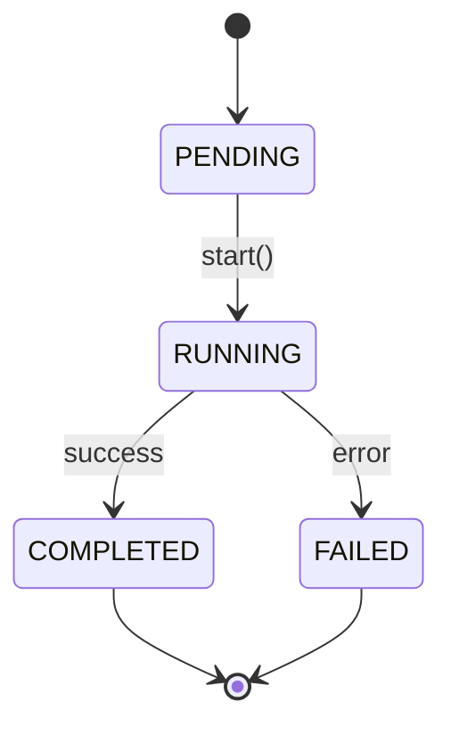

# [FR-XXX] [Entity] Lifecycle

## Description
The system **SHALL** manage the lifecycle of `[Entity]` through a state machine with the following states and transitions.

## Related User Stories
- [US-XXX]: [Story Title]

---

## States & Transitions

## Guards
| Transition | Guard Condition | Description |
|-----------|-----------------|-------------|
| PENDING → RUNNING | [condition] | [what must be true] |

---

## Constraints
| ID | Constraint | Type | Rationale | Validation |
|----|------------|------|-----------|------------|
| FR-XXX-CON-1 | Terminal states **SHALL** be immutable | Data | Auditability | Unit Test |

## Acceptance Criteria
| ID | Criteria | Verification Method |
|----|----------|---------------------|
| FR-XXX-AC-1 | Entity starts in PENDING state | Unit Test |
| FR-XXX-AC-2 | Transition from [state] to [state] requires [guard] | Unit Test |
| FR-XXX-AC-3 | Invalid transitions **SHALL** raise error | Unit Test |

## Dependencies
- **Upstream**: [entity FR that this lifecycle governs]
- **Downstream**: [FRs that react to state changes]
