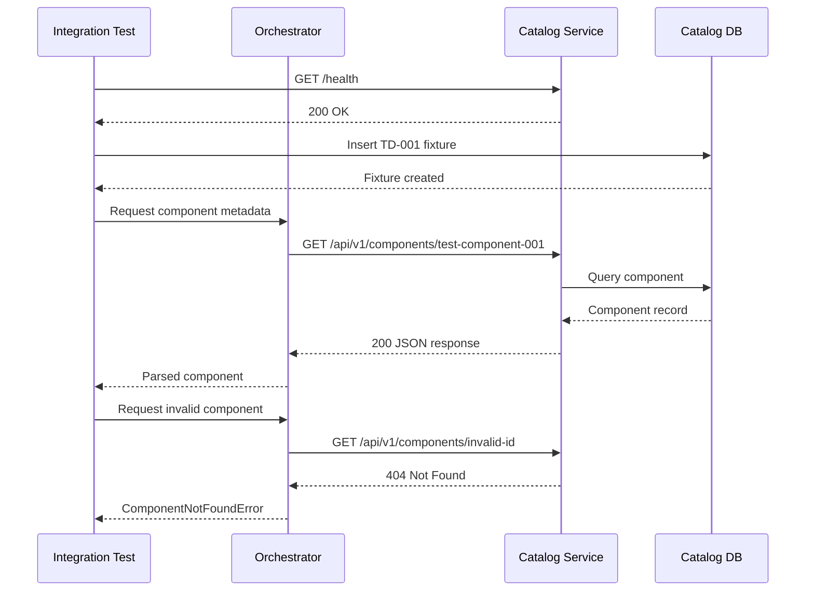

# IT-001: Catalog Service Component Retrieval

## Metadata

- ID: IT-001
- Version: 1.0
- Status: Active
- Priority: High
- Last Updated: 2026-01-30
- Author: Platform Team
- Target Integration: Catalog Service HTTP API
- Automation: Automated
- Traceability: FR-012, catalog-service/FR-001, StR-003

---

## 1. Purpose

Verify the orchestrator service can successfully retrieve component metadata from the catalog service over HTTP. Without this test, failures in the HTTP client configuration, DNS resolution, or response parsing would only surface during scenario execution, making root cause identification difficult.

## 1.1 Sequence Diagram

---

## 2. Dependencies

### Test Dependencies
None - this is a foundational integration test.

### Blocks
Tests that depend on this test passing:
- IT-005: Component deployment planning (requires component metadata)
- IT-008: Scenario execution flow (requires catalog lookups)

### Cross-Component References
Requirements from other service specs that this test verifies:
- catalog-service/FR-001: Catalog SHALL expose component metadata via REST API
- catalog-service/NFR-003: API response time SHALL be under 500ms at p95

---

## 3. Target Integration

### Service Under Test
Orchestrator Service (`orchestrator-service`)

### External Dependency
Catalog Service (`catalog-service.ix`) exposing REST API on port 8000. Protocol: HTTP/1.1. Endpoint pattern: `GET /api/v1/components/{component_id}`

### Integration Type
- HTTP Client

---

## 4. Preconditions

### Environment Requirements
- KIND cluster running with split DNS configured
- `catalog-service` deployed and healthy (readiness probe passing)
- Network policy allows orchestrator -> catalog traffic on port 8000

### Data State
- Catalog service has at least one component record with known ID
- TD-001 fixture component exists with status ACTIVE
- No concurrent tests modifying this component record

---

## 5. Test Data

### Input Data
- TD-001: `test-component-001` - Standard component fixture with known fields
  - Chosen because it exercises UUID path parameter parsing
  - Represents typical production component structure

### Expected Response Data
JSON response containing:
- `id`: matches requested component ID
- `name`: non-empty string
- `version`: semantic version string
- `status`: ACTIVE
Response expected within 5 seconds (p99 latency target).

---

## 6. Execution Plan

> [!IMPORTANT]
> Each discrete action MUST be its own step. Do not combine multiple actions (start service, load data, call API) into one step. Each step has independent success criteria that must pass before proceeding.

### Step 1: Deploy Catalog Service
Action: Deploy catalog-service to KIND cluster using helm chart.
Why: Establishes the external dependency for this integration test.
Timeout: 120 seconds
Success Criteria: 
- IT-001-SC-01: Catalog service pod status is Running
- IT-001-SC-02: All containers in pod are Ready

### Step 2: Load Test Data Fixture
Action: Insert TD-001 fixture component into catalog database.
Why: Creates deterministic known state for verification.
Timeout: 10 seconds
Success Criteria: 
- IT-001-SC-03: Fixture record exists in database
- IT-001-SC-04: Record queryable via internal API

### Step 3: Verify Catalog Service Readiness
Action: Send HTTP GET to catalog service health endpoint at `/health`.
Why: Confirms the dependency is reachable before testing business logic, isolating network issues from application errors.
Timeout: 5 seconds
Success Criteria: 
- IT-001-SC-05: HTTP 200 response from `/health`
- IT-001-SC-06: Response body indicates `status: healthy`

### Step 4: Request Component Metadata
Action: Execute HTTP GET to `/api/v1/components/test-component-001` using the CatalogClient.
Why: Exercises the primary integration path that scenario planning depends on.
Data Sent: HTTP request with Authorization header containing service-to-service token.
Timeout: 30 seconds
Success Criteria: 
- IT-001-SC-07: HTTP 200 response received
- IT-001-SC-08: Response time under 5000ms
- IT-001-SC-09: Content-Type is application/json

### Step 5: Validate Response Structure
Action: Parse JSON response and verify required fields are present and correctly typed.
Why: Schema drift between services is a common integration failure mode. Explicit field verification catches breaking changes early.
Success Criteria: 
- IT-001-SC-10: Field `id` equals `test-component-001`
- IT-001-SC-11: Field `name` is a non-empty string
- IT-001-SC-12: Field `version` matches semver pattern
- IT-001-SC-13: Field `status` equals `ACTIVE`

### Step 6: Verify Client Error Handling
Action: Request a non-existent component ID to verify error response handling.
Why: Ensures the client correctly interprets and propagates 404 responses without crashing.
Timeout: 5 seconds
Success Criteria: 
- IT-001-SC-14: HTTP 404 response received
- IT-001-SC-15: Client raises appropriate ComponentNotFoundError
- IT-001-SC-16: Error message includes the requested component ID

### Step 7: Cleanup
Action: Delete TD-001 fixture data from catalog database.
Why: Ensures test isolation for subsequent runs.
Timeout: 10 seconds
Success Criteria: 
- IT-001-SC-17: Fixture record removed from database

---

## 7. Expected Outcome

### Success Condition
All seven steps complete successfully. The orchestrator can retrieve component metadata from catalog service, parse the response correctly, and handle error cases gracefully.

### Failure Modes
- Connection timeout: Catalog service pod not running or DNS misconfigured
- HTTP 401/403: Service-to-service authentication not configured or token expired
- JSON parse error: Catalog service response schema changed
- Field validation failure: API contract drift between services

---

## 8. Traceability

| Requirement | Description |
|-------------|-------------|
| FR-012 | Orchestrator SHALL retrieve component dependencies from Catalog Service |
| catalog-service/FR-001 | Catalog SHALL expose component metadata via REST API |
| catalog-service/NFR-003 | API response time SHALL be under 500ms at p95 |
| StR-003 | System SHALL provide visibility into deployment component relationships |
| TD-001 | Test component fixture `test-component-001` |

---

## 9. Notes

This test uses fixture TD-001 that is loaded during test setup. The component ID `test-component-001` is reserved for integration testing and should not be modified by other tests. If this test fails consistently, check the catalog-service deployment logs for startup errors.

The cross-component reference to `catalog-service/FR-001` indicates this test also validates the catalog service's API contract, not just the orchestrator's client implementation.
