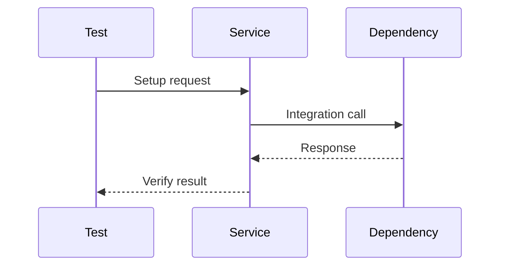

# IT-XXX: [Title]

## Metadata

- Priority: Critical | High | Medium | Low
- Last Updated: YYYY-MM-DD
- Author: [Name]
- Target Integration: [Service/System Name]
- Automation: Manual | Automated | Hybrid

---

## 1. Purpose

Describe WHY this test exists. What integration boundary does it verify? What failure mode would go undetected without this test?

## 1.1 Sequence Diagram

> [!TIP]
> A sequence diagram is strongly encouraged. It visualizes the integration flow and makes review easier.

---

## 2. Dependencies

### Test Dependencies
Other integration tests that must pass before this test:
- IT-XXX: [reason this is a prerequisite]

### Blocks
Tests that depend on this test passing:
- IT-XXX: [relationship]

### Cross-Component References
Requirements from other service specs that this test verifies:
- catalog-service/FR-XXX: [description]
- config-service/NFR-XXX: [description]

---

## 3. Target Integration

### Service Under Test
The component initiating the integration (your service).

### External Dependency
The external service, API, or system being connected to. Include protocol (HTTP, gRPC, AMQP) and endpoint pattern.

### Integration Type
- HTTP Client
- Event Publisher/Consumer
- Database Connection
- External API

---

## 4. Preconditions

### Environment Requirements
Required infrastructure state before execution:
- Services that must be running
- Network/DNS requirements
- Configuration parameters

### Data State
Required initial state in external systems:
- Existing records or resources
- Seed data dependencies
- Isolation requirements (unique IDs to avoid collision)

---

## 5. Test Data

### Input Data
Data used to exercise the integration:
- TD-XXX: [fixture name] - What data structures are sent
- Why these specific values matter
- Edge cases represented

### Expected Response Data
Data expected from the external service:
- Response structure
- Critical fields to verify
- Timing expectations

---

## 6. Execution Plan

> [!IMPORTANT]
> Each discrete action MUST be its own step. Do not combine multiple actions (start service, load data, call API) into one step. Each step has independent success criteria that must pass before proceeding.

### Step 1: [Start Dependency Service]
Action: Start the external service required for this test (e.g., "Deploy catalog-service to KIND cluster").
Why: Establishes the dependency that will be tested.
Timeout: 60 seconds
Success Criteria: 
- IT-XXX-SC-01: Service pod is running and ready

### Step 2: [Load Test Data]
Action: Seed required fixture data (e.g., "Insert TD-001 into catalog database").
Why: Creates known state for deterministic verification.
Timeout: 10 seconds
Success Criteria: 
- IT-XXX-SC-02: Fixture data exists and is queryable

### Step 3: [Verify Service Readiness]
Action: Confirm service is healthy (e.g., "Call GET /health on catalog-service").
Why: Ensures service is accepting requests before testing business logic.
Timeout: 5 seconds
Success Criteria: 
- IT-XXX-SC-03: Health endpoint returns HTTP 200

### Step 4: [Execute Integration Action]
Action: Perform the primary integration operation (e.g., "Call GET /api/v1/components/{id}").
Why: Exercises the integration boundary being tested.
Data Sent: Describe request payload or message content.
Timeout: 30 seconds
Success Criteria: 
- IT-XXX-SC-04: Response received within timeout
- IT-XXX-SC-05: Expected status code returned

### Step 5: [Validate Response]
Action: Parse and verify the response data.
Why: Confirms correct data transformation and contract compliance.
Success Criteria: 
- IT-XXX-SC-06: Required fields present
- IT-XXX-SC-07: Field values match expectations

### Step N: [Cleanup]
Action: Remove test artifacts (e.g., "Delete fixture data, stop service").
Why: Ensures test isolation for subsequent runs.
Success Criteria: 
- IT-XXX-SC-N1: Resources released

---

## 7. Expected Outcome

### Success Condition
The definitive statement of test success. All steps completed and all per-step criteria met.

### Failure Modes
Known ways this test can fail:
- Connection timeout (external service unavailable)
- Authentication failure (credentials expired)
- Data mismatch (schema drift or API change)

---

## 8. Traceability

| Requirement | Description |
|-------------|-------------|
| FR-XXX | Functional requirement this test verifies |
| StR-XXX | Stakeholder requirement addressed |
| NFR-XXX | Non-functional requirement (latency, availability) |
| TD-XXX | Test data fixture used |

---

## 9. Notes

Additional implementation context, known issues, or future considerations.
